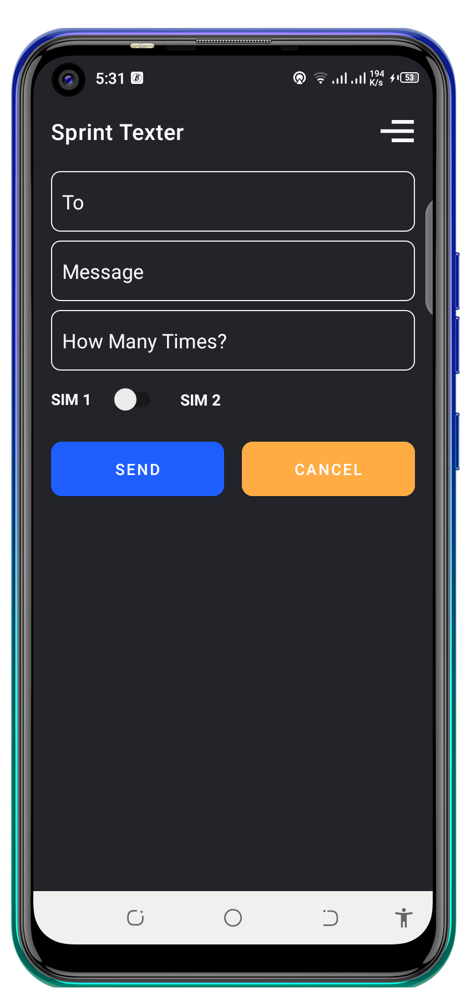
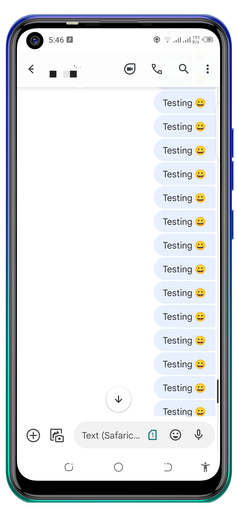

  
# Sprint Texter 🚀 🚀 🚀

A simple app that sends SMSs after every one 1 second. I was inspired by those TV and Radio competitions in Kenya where people are asked a given question, then that person that will send alot of messages will emerge the winner 😂 😂.
  
# Note: App Under Massive refactor and construction ️ ⚒️ ⚒️ 🚧 🚧 
  
Min Api Level : 16 

## Setup Requirements

- Android device or emulator
- Android Studio

## Getting Started

In order to get the app running yourself, you need to:

1.  Clone this project
2.  Import the project into Android Studio
3.  Connect the android device with USB or just use your emulator
4.  In Android Studio, click on the "Run" button.

## Libraries

Libraries used in the whole application are:

- [Kotlin](https://developer.android.com/kotlin) - Kotlin is a programming language that can run on JVM. Google has announced Kotlin as one of its officially supported programming languages in Android Studio; and the Android community is migrating at a pace from Java to Kotlin
- [Viewmodel](https://developer.android.com/topic/libraries/architecture/viewmodel) -The ViewModel class is designed to store and manage UI-related data in a lifecycle conscious way
- [LiveData](https://developer.android.com/topic/libraries/architecture/livedata) -  A lifecycle-aware data holder with the observer pattern
- [Kotlin Coroutines](https://developer.android.com/kotlin/coroutines) - A concurrency design pattern that you can use on Android to simplify code that executes asynchronously
- [Navigation Components](https://developer.android.com/guide/navigation/navigation-getting-started) -  Helps you implement navigation, from simple button clicks to more complex patterns, such as app bars and the navigation drawer.
- [Logging Interceptor](https://github.com/square/okhttp/blob/master/okhttp-logging-interceptor/README.md) -  logs HTTP request and response data.
- [Material Libarary](https://material.io/develop/android) -  Modular and customizable Material Design UI components for Android
- [Room Database](https://developer.android.com/jetpack/androidx/releases/room) -  The Room persistence library provides an abstraction layer over SQLite to allow for more robust database access while harnessing the full power of SQLite. 
- [View Binding](https://developer.android.com/topic/libraries/view-binding) - View binding is a feature that allows you to more easily write code that interacts with views.
- [SMS Manager](https://developer.android.com/reference/android/telephony/SmsManager) - Manages SMS operations such as sending data, text, and pdu SMS messages.

## Demo

  

  
## Support
- Found this project useful ❤️? Support by clicking the ⭐️ button on the upper right of this page. ✌️
- Notice anything else missing? File an issue 
- Feel free to contribute in any way to the project from typos in docs to code review are all welcome.
